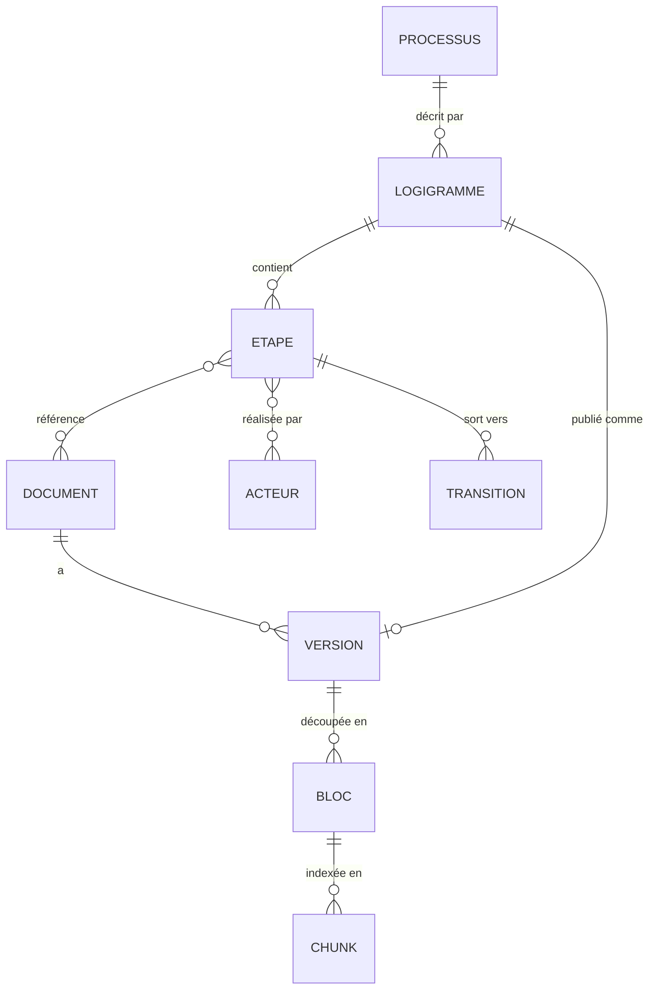

# Spec 02 — Modèle de données

> Le modèle canonique est le **contrat entre l'extraction et la recherche**. Tout ce qui
> n'y entre pas est perdu pour le RAG ; tout ce qui y entre mal produira des réponses
> fausses mais confiantes. Il est délibérément petit.

⚠️ Ce modèle est une **proposition** à réviser en fin de Phase 0 (spec 01, livrable 3).

---

## 1. Vue d'ensemble



Deux graphes coexistent et doivent rester **connectés** :

- le **graphe métier** (Processus/Logigramme/Étape/Acteur/Document) — il porte la
  navigation et la traçabilité ;
- le **graphe documentaire** (Document/Version/Bloc/Chunk) — il porte le texte indexé.

Le point de jonction est la relation `ETAPE ↔ DOCUMENT`. C'est elle qui permet à une réponse
de dire *« ceci s'applique à l'étape 4 »*, et à l'interface d'ouvrir le schéma au bon
endroit. **Si l'extraction ne produit pas cette relation, le produit se réduit à un moteur
de recherche plein texte ordinaire.**

---

## 2. Entités

### 2.1 Identifiants

Chaque entité porte un identifiant **stable, opaque et reproductible** :

```
ascocid://processus/<slug>
ascocid://logigramme/<slug>#v<indice>
ascocid://etape/<slug-logigramme>/<numero>
ascocid://document/<code-metier>            ex. ascocid://document/PR-QUA-012
ascocid://version/<code-metier>@<indice>    ex. ascocid://version/PR-QUA-012@C
ascocid://chunk/<sha256-des-16-premiers>
```

Règles :

- l'identifiant est **dérivé du contenu métier**, pas d'un auto-incrément : une
  réindexation complète doit reproduire exactement les mêmes identifiants ;
- si aucun code métier n'existe pour un document, on retombe sur
  `ascocid://document/sha256:<hash>` et on lève une anomalie (le document est
  non-traçable — c'est une information à remonter, pas à masquer) ;
- l'URL d'origine est **conservée à part** (`source_url`) : elle sert aux liens profonds,
  jamais d'identifiant (les URL bougent).

### 2.2 Champs

#### `Processus`
| Champ | Type | Obligatoire | Note |
|---|---|---|---|
| `id` | URI | ✔ | |
| `libelle` | str | ✔ | |
| `famille` | str? | | management / réalisation / support, si la cartographie en a |
| `parent_id` | URI? | | macro-processus |
| `source_url` | str | ✔ | |

#### `Logigramme`
| Champ | Type | Obligatoire | Note |
|---|---|---|---|
| `id` | URI | ✔ | |
| `processus_id` | URI | ✔ | |
| `titre` | str | ✔ | |
| `indice` | str? | | indice de révision du schéma |
| `cas_encodage` | enum | ✔ | A–F, cf. spec 01 §3 — **conservé** : il conditionne la confiance |
| `image_url` | str? | | rendu affichable |
| `largeur`, `hauteur` | int? | | repère pour le surlignage d'étape (spec 07) |
| `confiance_extraction` | float | ✔ | 1.0 pour les cas A–D/F, score du VLM pour E |

#### `Etape`
| Champ | Type | Obligatoire | Note |
|---|---|---|---|
| `id` | URI | ✔ | |
| `logigramme_id` | URI | ✔ | |
| `numero` | int | ✔ | ordre topologique ; à défaut, ordre de lecture |
| `libelle` | str | ✔ | texte du nœud |
| `type_noeud` | enum | ✔ | `debut` / `action` / `decision` / `document` / `fin` |
| `acteurs` | URI[] | | issus des couloirs quand ils existent |
| `documents` | URI[] | | **la relation qui porte toute la valeur** |
| `bbox` | [x,y,w,h]? | | coordonnées dans l'image → surlignage UI |
| `entrees`, `sorties` | str[] | | si le formalisme les porte |

#### `Transition`
`(etape_source, etape_cible, condition?)` — arête du logigramme. Permet de répondre à
« que se passe-t-il si le contrôle échoue ? ».

#### `Document` / `Version`
| Champ | Type | Obligatoire | Note |
|---|---|---|---|
| `document.id` | URI | ✔ | code métier |
| `document.code` | str? | ✔* | `PR-QUA-012` ; règle d'extraction = livrable Phase 0 |
| `document.type` | enum | ✔ | `procedure` / `mode_operatoire` / `formulaire` / `enregistrement` / `note` / `autre` |
| `document.titre` | str | ✔ | |
| `version.indice` | str | ✔ | `A`, `C`, `3`, … |
| `version.statut` | enum | ✔ | **`en_vigueur` / `perime` / `projet` / `inconnu`** |
| `version.date_application` | date? | | |
| `version.sha256` | str | ✔ | du fichier source |
| `version.source_url` | str | ✔ | |
| `version.nb_pages` | int | ✔ | |
| `version.classe_extraction` | enum | ✔ | `texte` / `mixte` / `scanne` |

#### `Bloc`
Unité sémantique issue du parsing, **avant** découpage pour l'index :
section, paragraphe, tableau, figure, légende. Champs : `version_id`, `ordre`, `type`,
`texte`, `page`, `bbox`, `titre_section`, `niveau`.

Le `Bloc` existe pour une raison : il permet de **rechunker sans re-parser**. Le parsing
(coûteux, potentiellement du VLM) est fait une fois ; la stratégie de découpage évoluera
plusieurs fois. Sans cette couche intermédiaire, chaque essai de chunking relance toute
l'ingestion.

#### `Chunk`
| Champ | Type | Note |
|---|---|---|
| `id` | URI | |
| `version_id`, `bloc_ids` | URI[] | remontée vers la source |
| `texte` | str | le texte réellement embarqué |
| `contexte` | str | phrase de contextualisation générée (spec 04 §3) |
| `page_debut`, `page_fin` | int | → lien profond `#page=` |
| `etapes` | URI[] | **hérité** des étapes qui référencent le document |
| `processus` | URI[] | idem, pour le filtrage |
| `statut` | enum | recopié de la version → filtre dur à la recherche |
| `dense`, `sparse` | vecteurs | stockés dans l'index, pas dans la base |

---

## 3. Le statut de version est un champ de premier ordre

Dans un référentiel qualité, répondre à partir d'un document périmé est pire que ne pas
répondre. Conséquences, appliquées partout :

1. `statut` est **obligatoire** et propagé jusqu'au `Chunk`.
2. La recherche filtre par défaut sur `statut = en_vigueur`.
3. `statut = inconnu` est **exclu de l'index de réponse** et listé dans un rapport
   d'anomalies. On ne devine pas.
4. Toute citation affichée porte le couple `code + indice`.
5. Si deux versions en vigueur du même code coexistent, c'est une **anomalie bloquante**
   remontée à la gouvernance documentaire, pas un cas à arbitrer par heuristique.

---

## 4. Stockage

Trois magasins, un rôle chacun, tous derrière un port (spec 06).

| Magasin | Techno | Contenu | Pourquoi |
|---|---|---|---|
| **Graphe + métadonnées** | SQLite (fichier unique, WAL) | Processus, Logigramme, Étape, Transition, Document, Version, Bloc, anomalies + index **FTS5** sur codes/titres/libellés | Requêtes relationnelles et récursives (CTE) triviales ; zéro exploitation ; FTS5 donne la recherche exacte de code documentaire, que le vectoriel rate systématiquement. Migration vers PostgreSQL sans changer le code métier si le besoin apparaît. |
| **Index vectoriel** | Qdrant (conteneur) | Chunks : vecteurs nommés `dense` + `sparse`, payload de filtrage | Hybride dense/sparse et fusion côté serveur, filtres sur payload performants, snapshots pour la reproductibilité. |
| **Fichiers** | Système de fichiers, adressage par contenu `blobs/<sha256[:2]>/<sha256>` | PDF, images, rendus de schémas, JSON de parsing | Déduplication native, ingestion idempotente, rejouable hors-ligne. |

Le graphe **n'a pas besoin d'une base graphe dédiée** à cette volumétrie (D5). Un
`WITH RECURSIVE` sur SQLite traverse un graphe de quelques dizaines de milliers de nœuds
en millisecondes. Introduire Neo4j ici ajouterait un service à exploiter pour un gain nul.

## 5. Schéma relationnel (extrait)

```sql
CREATE TABLE version (
    id                TEXT PRIMARY KEY,
    document_id       TEXT NOT NULL REFERENCES document(id),
    indice            TEXT NOT NULL,
    statut            TEXT NOT NULL CHECK (statut IN ('en_vigueur','perime','projet','inconnu')),
    date_application  TEXT,
    sha256            TEXT NOT NULL,
    source_url        TEXT NOT NULL,
    nb_pages          INTEGER NOT NULL,
    classe_extraction TEXT NOT NULL,
    UNIQUE (document_id, indice)
);

-- Un seul document en vigueur par code : la contrainte est dans la base, pas dans le code.
CREATE UNIQUE INDEX ux_version_en_vigueur
    ON version (document_id) WHERE statut = 'en_vigueur';

CREATE TABLE etape_document (
    etape_id     TEXT NOT NULL REFERENCES etape(id),
    document_id  TEXT NOT NULL REFERENCES document(id),
    origine      TEXT NOT NULL,   -- 'imagemap' | 'svg' | 'vlm' | 'manuel' | ...
    confiance    REAL NOT NULL,
    PRIMARY KEY (etape_id, document_id)
);

CREATE VIRTUAL TABLE recherche_exacte USING fts5(
    cible_id UNINDEXED, code, titre, libelle, tokenize = "unicode61 remove_diacritics 2"
);
```

`etape_document.origine` et `.confiance` ne sont pas décoratifs : ils permettent de
distinguer une relation **lue** dans le HTML d'une relation **devinée** par un VLM, et donc
de calibrer la confiance affichée à l'utilisateur (spec 07 §4).

## 6. Invariants vérifiés en continu

Contrôles exécutés après chaque ingestion ; un échec bloque la publication de l'index.

| # | Invariant |
|---|---|
| I1 | Tout `Chunk` remonte à une `Version` existante et à un fichier présent dans `blobs/`. |
| I2 | Toute `Version` avec `statut = en_vigueur` est unique pour son `document_id`. |
| I3 | Tout `Logigramme` a ≥ 1 `Etape`. |
| I4 | Toute `Etape` de type `document` a ≥ 1 document lié, ou est marquée en anomalie. |
| I5 | Aucun `Chunk` indexé n'a `statut ∈ {perime, inconnu}`. |
| I6 | Le nombre d'étapes par logigramme est cohérent avec la vérité terrain sur les 10 schémas annotés (spec 01, livrable 4). |
| I7 | Les identifiants sont stables : une réindexation à corpus identique produit le même ensemble d'`id`. |
